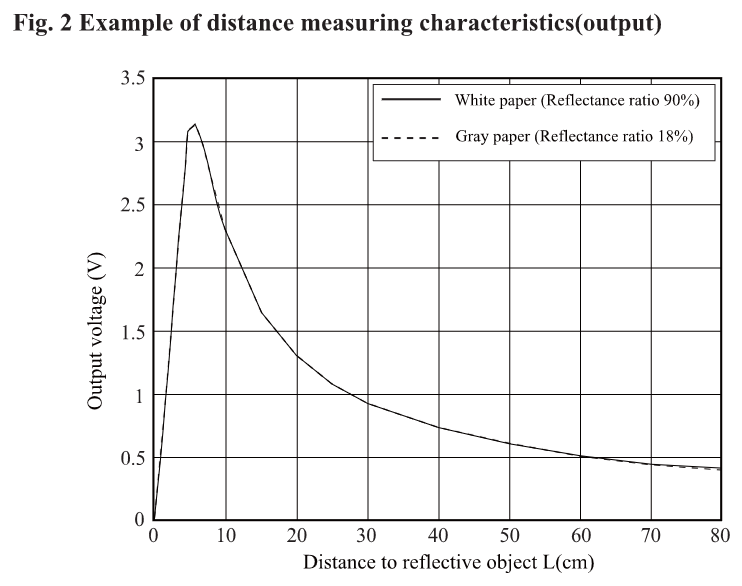

# STM32G431KB

[Documentation du STM32G431KB](https://www.farnell.com/datasheets/3182254.pdf)
[Datasheet du STM32G431KB](https://www.st.com/resource/en/datasheet/stm32g431c6.pdf) (notamment pour les Alternate Functions)

Rappel des opérateurs binaires
* ``&=`` applique un masque AND. Par exemple ``0xE &= 0x3`` donne ``0x2``.
* ``|=`` applique un masque OR. Par exemple ``0xE |= 0x3`` donne ``0xF``.
* ``^=`` applique un masque XOR. Par exemple ``0xE ^= 0x3`` donne ``0xD``.
* ``~`` inverse un nombre. Par exemple, ``0xE &= ~(0x3)`` donne ``0xB``.
* ``<<`` fait un shift de N bits vers la gauche. Par exemple, ``0x2000 |= (0x1 << 2 )`` renvoie ``0x2100``. 

# 2Y0A21

Télémètre à 1 broche de données
Module nécessaire : ADC (ou CAN en français)

## Fonctionnement du 2Y0A21 et précisions

Le télémètre doit être alimenté avec 5V.
La prmeière valeur de sortie est dite "instable" et doit être ignorée.
Une mesure dure eviron 50ms. 

La mesure de distance sera efficace entre 10cm et 80cm. 
En dessous de 10, la tension est totalement différente, et au-delà de 80cm les différences deviennent trop minimes.

## Setup de l'horloge (HSI)

* Il faut que les horloges des ``GPIOA`` et ``GPIOB`` soient activées (dans le registre ``RCC_AHB2ENR``).

* Dans le registre de contrôle d'horloge ``RCC_CR`` on peut activer l'horloge ``HSI`` (High Speed Internal, 16MHz) ainsi que lire le flag ``HSIRDY`` pour savoir si l'horloge ``HSI`` est correctement initialisée.
* On va ensuite setup l'horloge ``HSI`` en tant que ``SYSCLK`` (horloge du système) dans le registre ``CCIPR`` puis ``CFGR``.
* Enfin, dans ce même registre ``CFGR``, on peut modifier les fréquences vers les différents bus (AHB, APB1, APB2). On n'a aucun intérêt à mettre des divisions ici.

## Setup de l'ADC

* On active l'ADC que l'on souhaite dans le registre ``RCC_AHB2ENR`` (comme pour GPIOA et GPIOB).
* On configure notre broche de l'ADC dans le registre ``GPIOx_MODER``. On le setup en Analog.
* On configure l'horloge reliée à l'ADC dans deux registres. Premièrement le registre ``ADCx_CCR`` (Common Control Register, ``ADCx_COMMON->CCR`` en C). C'est ici qu'on peut indiquer si on veut une horloge synchrone ou asynchrone (je conseille asynchrone avec la SYSCLK) ainsi que le prescaler (je conseille de n'appliquer aucune division). Deuxièmement le registre ``ADC_CR`` pour désactiver le Deep Power Down (DEEPPWD) ainsi qu'allumer le régulateur de tension (ADVREGEN). On peut également setup le mode de mesure (différentiel, donc différence de tension entre deux branches, ou alors mesure par rapport au GND) et calibrer l'ADC avec le flag ``ADCAL`` (on le met à 1 et il repassera automatiquement à 0 quand la calibration est finie).
* On règle le mode de conversion de l'ADC (contenu, unitaire...) dans le registre ``ADC_CFGR``.
* ``ADC_SQRx`` est un registre dont le premier mot de 4 bits est le mot ``L`` pour représenter le nombre de conversions souhaitées par séquence. Par exemple 0000 = 1 conversion par séquence de conversions, 0001 = 2 conversions, ..., 1111 = 16 conversions.
* Ensuite les adresses de SQ1 à SQ4 représentent les canaux de l'ADC que l'on souhaite paramétrer. 
* On sélectionne ensuite le temps d'échantillonnage avec le registre ``ADC_SMPRx``. 
* On passe le flag ``ADRDY`` (ADC ready) du registre ``ADC_ISR`` à 1, et on active l'ADC dans le registre ``ADC_CR`` avec le flag ``ADEN``. Enfin, on fait la même avec le flag ``ADSTART`` du registre ``ADC_CR``.

## Lire une valeur de l'ADC

* La valeur de l'ADC se récupère dans le registre ``ADC_DR``. Cependant il faut d'abord faire attention à certains paramètres:
* L'ADC peut provoquer un overrun, dans ce cas-là il deivent incapable de convertir. C'est indiqué par le flag ``OVR`` du registre ``ADC_ISR``. On reset le flag en écrivant 1 dedans. Pour s'assurer qu'il fait une séquence complète, on peut regarder le flag ``EOS`` du registre ``ADC_ISR``. On reset le flag en écrivant 1 dedans.
