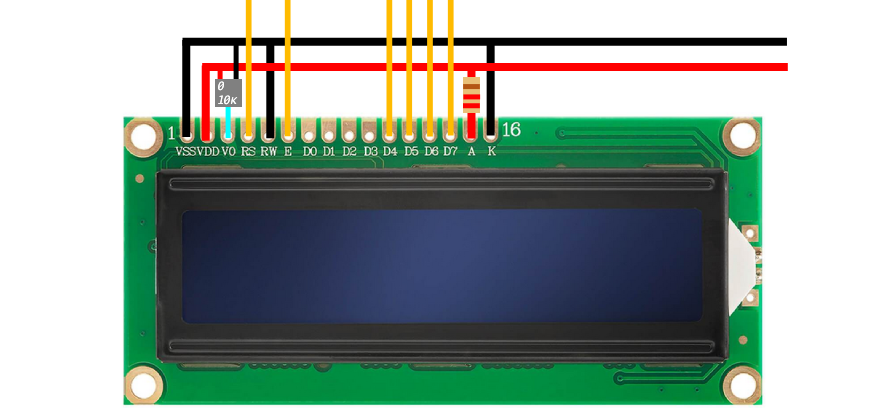

# STM32G431KB

[Documentation du STM32G431KB](https://www.farnell.com/datasheets/3182254.pdf)
[Datasheet du STM32G431KB](https://www.st.com/resource/en/datasheet/stm32g431c6.pdf) (notamment pour les Alternate Functions)

Rappel des opérateurs binaires
* ``&=`` applique un masque AND. Par exemple ``0xE &= 0x3`` donne ``0x2``.
* ``|=`` applique un masque OR. Par exemple ``0xE |= 0x3`` donne ``0xF``.
* ``^=`` applique un masque XOR. Par exemple ``0xE ^= 0x3`` donne ``0xD``.
* ``~`` inverse un nombre. Par exemple, ``0xE &= ~(0x3)`` donne ``0xB``.
* ``<<`` fait un shift de N bits vers la gauche. Par exemple, ``0x2000 |= (0x1 << 2 )`` renvoie ``0x2100``. 

# LCD 16x2

Ecran LCD à 4 ou 8 broches de données. On utilisera le mode 4 bits, dans cet ordre:
D7 - D6 - D5 - D4
Donc par exemple l'instruction ``0x03`` va activer les broches D5 et D4.

## Fonctionnement du LCD et précisions

Nous allons utiliser l'écran en mode 4 bits.
On le branche sur du 5V. 
Cet écran n'utilise pas de procotole particulier. On lui envoie des instructions en hexadécimal en utilisant la table d'instructions, et on envoie une pulsation dans la broche E qui exécute l'instruction.

Pour réinitialiser l'écran, on envoie trois fois l'instruction 0x03 (broches D4 et D5). Cette instruction n'est pas citée dans la table.

## Setup du GPIO

* Les horloges des ``GPIOA`` et ``GPIOB`` sont activées dans le registre dans le registre ``RCC_AHB2ENR``.
* On sélectionne le mode (input, output, etc...) des broches dans le registre ``MODER``, on peut les mettre en open-drain ou en push-pull dans le registre ``OTYPER``, et mettre en place une résistance de tirage dans le registre ``PUPDR``. 
* Les valeurs de sortie de chaque broche sont gérées dans le registre ``ODR``.

## Mettre en place les instructions

* Une instruction est communiquée sous cette forme:
DATA PINS aux bonnes valeurs -> Broche E en valeur haute -> Broche E en valeur basse

* Idéalement on met des délais d'au moins deux millisecondes entre chaque instruction car l'écran a besoin de temps pour traiter les instructions. 
* Quand on utilise le LCD en mode 4 bits, on envoie 2 instructions de 4 bits au lieu d'une instruction de 8 bits.
* Pour correctement régler l'écran, on va faire cet ordre d'instructions:
1. ETEINDRE ECRAN (``0x8``)
2. RESET (``0x3`` -> ``0x3`` -> ``0x3``)
3. MODE 4 BITS (``0x2``)
4. CLEAR DISPLAY (``0x0`` -> ``0x1``)
5. RETURN HOME (``0x0`` -> ``0x2``)
6. ALLUMER ECRAN (``0x0`` -> ``0xD``, ``0xE`` ou ``0xF``)

* Pour ensuite écrire des caractères, on passe la broche RS à 1 et on envoie des instructions en ASCII. Par exemple, "FLOE" sera : 

``0x46``=(``0x4``->``0x6``), ``0x4C``=(``0x4``->``0xC``), ``0x4F``=(``0x4``->``0xF``), ``0x45``=(``0x4``->``0x5``)