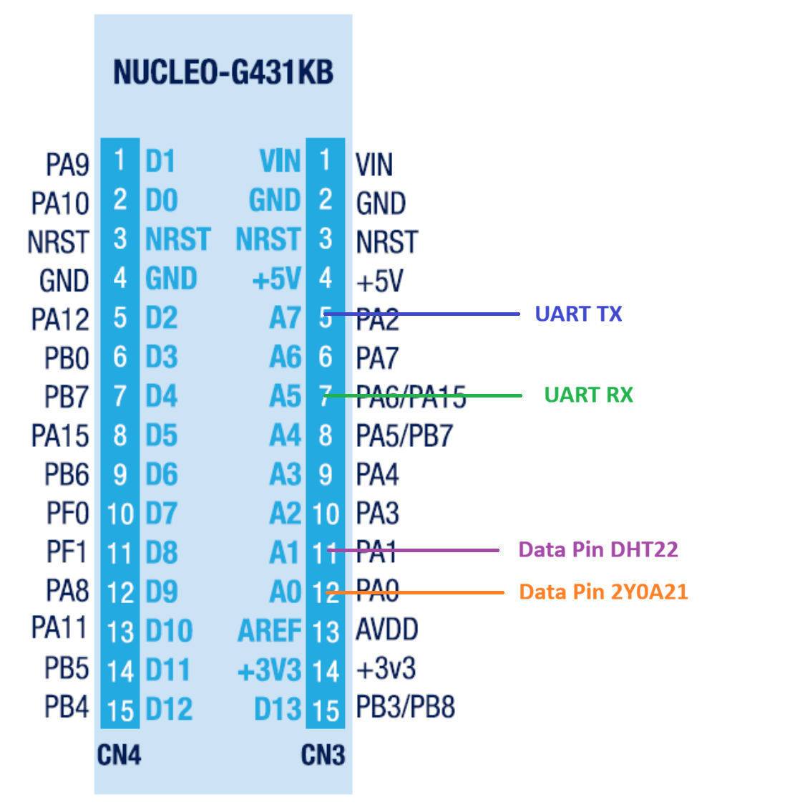
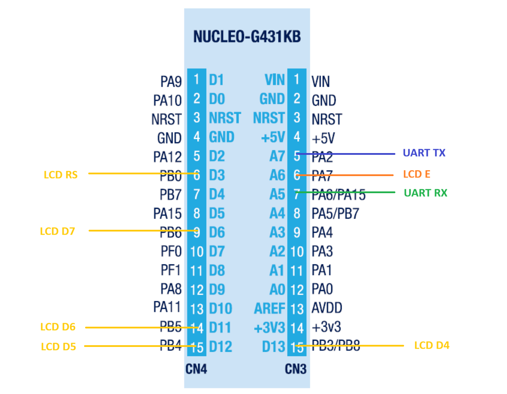

# Titre

TODO

## Description du projet

IETR Nantes - Ce projet configure deux STM32G431KB en bare metal afin d'interfacer et communiquer avec divers composants.

## Getting started

### Matériel

* Nucleo-G431KB x2
* DHT22 
* 2Y0A21
* LCD 16x2 

### Détails

* Interface du DHT22
* Interface du 2Y0A21
* Interface du LCD
* Interruptions externes (EXTI, IRQ)
* Communication en USART entre les deux Nucleo-G431KB

### Utilisation

* Vérifier que les composants soient bien branchés aux bons pins:

* Brancher les deux cartes. Appuyer sur un des trois boutons de requête avec la carte reliée à l'écran.
* La carte reliée aux composants devrait répondre avec la donnée demandée parmis les trois:
1. TEST
2. Données du DHT22
3. Données du 2Y0A21

### Modifier

* Si vous souhaitez modifier les paramètres de l'écran, [Lien vers la datasheet](https://www.vishay.com/docs/37484/lcd016n002bcfhet.pdf)
* Si vous souhaitez modifier les paramètres du DHT22, [Lien vers la datasheet](https://cdn.sparkfun.com/assets/f/7/d/9/c/DHT22.pdf)
* Si vous souhaitez modifier les paramètres du 2Y0A21, [Lien vers la datasheet](https://global.sharp/products/device/lineup/data/pdf/datasheet/gp2y0a21yk_e.pdf)